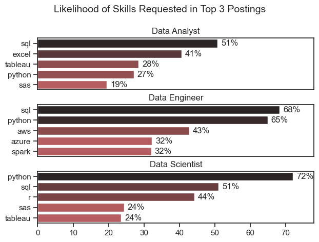
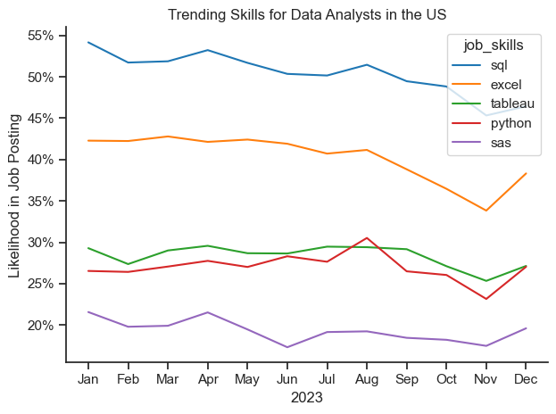
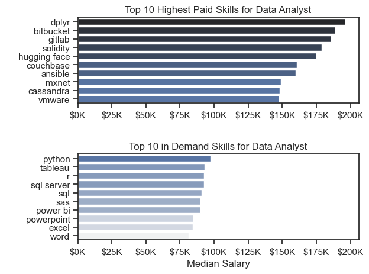

# Introduction 
#### I started this project to practice and brush up on skills in Python and relevant libraries required for Data Analysis while also learning some new skills. I have noticed that the ability to  leverage Python is important and companies everyday are requiring their data analysts to learn how to utilize this powerful tool. So I created this repository to showcase my core Python Skills for employers. For my first project, I recreated a project that was done by Luke Barousse who is a Youtuber that posts valuable info and tutorials on data analytics. I have linked the video I used for this project along with Luke's Github below! 

### Libraries Used:
- Matplotlib
- Pandas
- Seaborn 
- Numpy


#### Video Link:  https://www.youtube.com/watch?v=wUSDVGivd-8&t=20753s 

#### Github Link: https://github.com/lukebarousse

# Required Job Skills
## Analysis 
#### Finding the most popular skills in job postings required some basic filtering of the dataframe followed by exploding the job skills list into individual rows. After adjusting the dataframe to what I needed I plotted the data into bar charts with each bar representing a different skill. 
``` python
job_titles = df_skills_count['job_title_short'].unique().tolist()

job_titles = sorted(job_titles[:3])

fig, ax = plt.subplots(len(job_titles), 1)
sns.set_theme(style='ticks')

#Creating a for loop to plot each seperate job_title that I mentioned in my list

for i, job_title in enumerate(job_titles):
    df_plot = df_skills_perc[df_skills_perc['job_title_short'] == job_title].head()
    sns.barplot(data=df_plot, x='skill_percent', y='job_skills', ax=ax[i], hue='skill_percent', palette='dark:r_r')
    ax[i].set_title(job_title)
    ax[i].set_ylabel('')
    ax[i].set_xlabel('')
    ax[i].legend().set_visible(False)
    ax[i].set_xlim(0,78)
    
    if i != len(job_titles) - 1:
        ax[i].set_xticks([])
    
    for n, v in enumerate(df_plot['skill_percent']):
        ax[i].text(v + 1, n, f'{v:.0f}%', va = 'center')


fig.suptitle(f'Likelihood of Skills Requested in Top {len(job_titles)} Postings', fontsize=14)
fig.tight_layout(h_pad=0.5)
plt.show()
```
#### View the notebook with detailed steps [[here](3_Skills_Demand.ipynb)]:




## Insights
#### In the image above you'll see the percentage chance that a skill will be required for a specific job. The plot shows that Python is a sought after skill and is typically one that Data Scientists and Data Engineers need to know. Data Analysts also need to know Python as well but it is not as common. Additionally SQL is typically a required skill in over 50% of job postings for Data Analysts and Data Scientists. 

# Trends of Job Skills 
## Analysis 
#### It is important to know what job skills are required for certain roles, but what if certain skills are not as useful as time goes on? I wanted to observe the trend of job skils for data analyst roles. To do this I filtered my data for Data Analyst roles in the United States. After doing this I created a pivot table showing counts of job skills by the month. After getting my final dataframe, I filtered my data for the top 5 most prevalent skills and created a line chart using the seaborn library.
``` python
df_plot = df_da_us_percent.iloc[:,:5]

sns.lineplot(data=df_plot, dashes=False, palette='tab10')
sns.set_theme(style='ticks')
sns.despine()

plt.title('Trending Skills for Data Analysts in the US')
plt.ylabel('Likelihood in Job Posting')
plt.xlabel('2023')

from matplotlib.ticker import PercentFormatter
ax = plt.gca()
ax.yaxis.set_major_formatter(PercentFormatter(decimals=0))


plt.tight_layout()
```
#### View the notebook with detailed steps [here](4_Skills_Trends.ipynb)


## Insights 
#### As you can see from the image, there is no skill that seems to be increasing or decreasing in prevelancy rapidly. We notice a slight decrease in the likelihood that SQL will be in a job posting but even with the decrease, SQL still remains the most common skill required for Data Analysts. Adittionally Python had a short burst in August where it trended above Tableau but it quickly went back to normal the following month.

# Salary Analysis 
## Analysis
#### Similar to previous notebooks, in this notebook I wanted to do some more analysis on Data Analyst jobs in the United States. I created two seperate dataframes with the Top 10 most common skills for data analysts and the Top 10 skills with the highest median salaries.
``` python 
#Creating a subplot
fig, ax =plt.subplots(2,1)


sns.set_theme(style='ticks')


sns.barplot(data=df_da_top_pay, x='median', y=df_da_top_pay.index, ax=ax[0], hue='median', palette='dark:b_r', legend=False)

ax[0].set_title('Top 10 Highest Paid Skills for Data Analyst')
ax[0].set_ylabel(' ')
ax[0].set_xlabel(' ')
ax[0].xaxis.set_major_formatter(plt.FuncFormatter(lambda x, _: f'${int(x/1000)}K'))


sns.barplot(data=df_da_skills, x='median', y=df_da_skills.index, ax=ax[1], hue='median', palette='light:b', legend=False)

ax[1].set_title('Top 10 in Demand Skills for Data Analyst')
ax[1].set_ylabel(' ')
ax[1].set_xlabel('Median Salary')
ax[1].xaxis.set_major_formatter(plt.FuncFormatter(lambda x, _: f'${int(x/1000)}K'))


#changing the xlim for both figures by set_xlim on the bottom plot to match the current xlim of top plot
ax[1].set_xlim(ax[0].get_xlim())

fig.tight_layout()
```
#### View the notebook with detailed steps [here](5_Salary_Analysis.ipynb)



## Insights
#### Its important to note that the skills that match with the highest median salaries are not exactly the most accurate. Diving deeper into the data we notice that the number of job postings with the highest median salaries are quite low. The sample size of the data is too small to make any conclusions about the data. What we notice from the lower subplot is that knowing Python, Tableau and R will be beneficial in getting a higher salary whereas Microsoft tools like Powerpoing, Excel and Word are typically not as valuable to learn.
